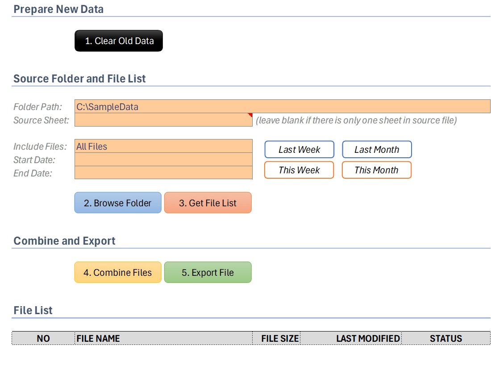

# Overview
This is small automated tool for combining data files from a selected folder using **Excel VBA code**. The tool also enables user to export the combined data into another file.

The tool supports the following file types:
* Excel Workbook (xls and xlsx)
* Excel Macro Enable Workbook (xlsm)
* Excel Binary Workbook (xlsb)
* CSV File (csv)
* Tab Delimiter File (txt)

For Export feature, the tool supports the following file types:
* Excel Workbook (xlsx)
* Excel Binary Workbook (xlsb)
* CSV File (csv)
* Tab Delimiter File (txt)

# Why This Tool?
We want to create a simple and easy to use tool for normal Excel users without the need to go with Power Query for the same task.

The tool provides many basic features as following:
* Browse a source folder on your PC or network drive
* Display file(s) in the selected folder
	* List all supported files
	* List files based on start date and end date (use file last modified date for the condition)
* Combine the displayed files into one sheet
* Export the combined data into another supported file

I personally feel that Power Query is over-killed for combining files within a selected folder. There are many steps to achieve this simple task. If the user requires to combine only files within a specific period, following Power Query is more difficult to achieve than our developed tool.

# User Interface
Our design is very simple to use. We provide five main buttons for user to work with.

* **Clear Old Data**: clear the interface and existing data if there is any.
* **Browse Folder**: browse the source folder for the file combination.
* **Get File List**: display the supported file(s) from the source folder.
	* User has option to include `All Files` or `Start End Date`.
	* We provide four buttons for Start Date and End Date
		* *Last Week*: last week from the current date
		* *Last Month*: last month of the current date
		* *This Week*: this week of the current date
		* *This Month*: the current month of the current date
	* The file list can be manually modified by the user.
		* For example, after listing all files from the source folder, user can *keep only the first three files* by removing the rows under the file list.
		* This makes our tool more flexible to use in various scenarios.
* **Combine Files**: combine the file(s) from the file list.
* **Export File**: export the combined data to another file (supported export file types above)

# Technical Implementation
## Our Assumptions
This tool has the following assumptions:
* The source file or source sheet has data that start from the first row.
* The source file or source sheet data has column header on the first row.

## File Listing
We decided to use the existing sub procedure from VBA `Dir()`. It is simple and quick without depending on another external library `FileSystemObject`.

To get the last modified date of a file, we also use the existing procedure from VBA `FileDateTime()` without using `FileSystemObject`.

We list the file(s) and display the following information:
* File Name
* File Size in KB
* Last Modified Date (using `FileDateTime()`)
* Status: status when the tool combines the file(s)
	* `NOT EXIST`: the listed file does not exist in the folder
	* `EMPTY`: the source file is found but the file has no data.
	* `COMPLETED`: the data in the source file is copied successfully.

## How we check empty file?
We detect empty file using a very simple technique. We check the following data:
* Empty is `True` if Cell `A1` is blank and Cell `B1` is blank and Cell `C1` is blank.

## Source Sheet
Since our tool support Excel File Types (xls, xlsx, xlsm, and xlsb), there is possibility that there are many sheets within the source file.

We allow the user to specify the `Source Sheet`. The Source Sheet is the name of the sheet that user would like to copy the data. `Source Sheet` is case sensitive. The tool expect the sheet name to be exactly the same as in the source file.

If the Excel file contains only one sheet, `Source Sheet` can be empty. The reason is that if the Excel file has only one sheet, that one sheet will be activated by default. This logic is also applicable to `CSV` and `TXT` file.

## Combine File(s)
To copy data from source file, we first copy the data in store in a temporary sheet in our tool (`Sheet Temp`). Then we copy the data from `Sheet Temp` to `Sheet Final Data`.

* Copy data from Source File to Sheet Temp: we decided to use `Advanced Filter` technique. Advanced Filter provides the quickest way to copy data.
* Copy data from Sheet Temp to Sheet Final Data: we decided to use `Copy-Paste` technique. The reason is that we need to paste data continuously at the last row for combination. `Advanced Filter` does not support such scenario.

# Contact

If you’re interested in discussing this project or has any question:

* LinkedIn: https://www.linkedin.com/in/vengm/
* Email: khmer.keang@gmail.com
